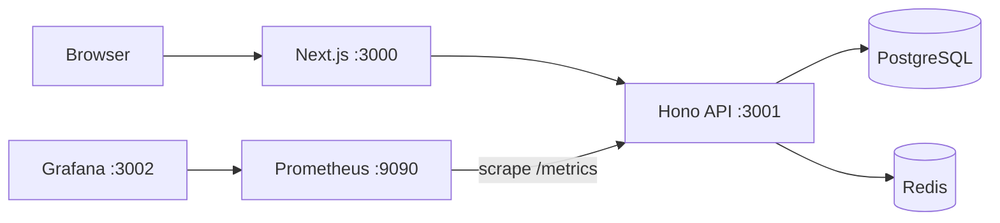

# Hyphai

**Универсальный чат как живая сеть** — monorepo, Docker, spec-driven разработка.

Full-stack чат с realtime, streaming LLM, ветками диалогов и публичным share. Код в `apps/web` + `apps/api`, инфраструктура — одной командой Docker Compose.

[](.github/workflows/ci.yml)
[](https://opensource.org/licenses/MIT)

---

## Содержание

- [Архитектура](#архитектура)
- [Почему этот стек](#почему-этот-стек)
- [Быстрый старт](#быстрый-старт)
- [LLM (OpenRouter)](#llm-openrouter)
- [Observability](#observability)
- [CI/CD](#cicd)
- [Deploy](#deploy)
- [API](#api)
- [Hyphae network](#hyphae-network)

---

## Архитектура



| Слой | Пакет | Роль |
|------|-------|------|
| UI | `apps/web` | Next.js, auth, чат, landing |
| API | `apps/api` | REST, WebSocket, OpenRouter |
| DB / Pub/Sub | PostgreSQL, Redis | данные + fan-out WebSocket |
| Metrics | Prometheus, Grafana | метрики API, дашборды |

---

## Почему этот стек

### Frontend: Next.js 16 + React + Tailwind

| Критерий | Next.js (Hyphai) | Remix / Vite SPA |
|----------|------------------|------------------|
| SSR / SEO | App Router из коробки | SPA хуже для landing |
| Deploy | `standalone` в Docker | SSR настраивается отдельно |
| DX | TypeScript, Tailwind 4 | Сопоставимо |

### Backend: Hono + Bun

| Критерий | Hono + Bun | Express + Node |
|----------|------------|----------------|
| Cold start | Быстрый Bun | Тяжелее runtime |
| TypeScript | Нативно | Нужен toolchain |
| WebSocket | Встроен в Hono | Отдельный `ws` + adapter |
| Docker-образ | Меньше | node_modules крупнее |

### Data: PostgreSQL + Kysely

| Критерий | Postgres + Kysely | Prisma / SQLite |
|----------|-------------------|-----------------|
| SQL | Явные запросы, типы из схемы | ORM-магия / один файл |
| Concurrency | Несколько инстансов API | SQLite блокирует запись |
| Production | Стандарт для SaaS | SQLite — dev/edge |

### Realtime: Redis pub/sub

| Критерий | Redis Pub/Sub | Sticky / in-memory |
|----------|---------------|---------------------|
| Несколько API | События на любой инстанс | Affinity у LB |
| Scale | Один Redis, канал на диалог | Ломается при горизонтали |

### Workflow: OpenSpec

| Критерий | OpenSpec | Ad-hoc specs |
|----------|----------|--------------|
| Source of truth | `openspec/specs/` | Разъезжается с кодом |
| Цикл | proposal → design → tasks → apply | Нет единого процесса |

### LLM: OpenRouter

| Критерий | OpenRouter | Self-hosted |
|----------|------------|-------------|
| Старт | API key, без GPU | GPU, модели, ops |
| Модели | Десятки через один API | Одна–две локально |

---

## Быстрый старт

### Docker (всё сразу)

```bash
cp .env.example .env
# OPENROUTER_API_KEY в .env
docker compose up --build -d
```

| Сервис | URL | Логин |
|--------|-----|-------|
| Web | http://localhost:3000 | регистрация в UI |
| API | http://localhost:3001 | — |
| Health | http://localhost:3001/health | — |
| Prometheus | http://localhost:9090 | — |
| Grafana | http://localhost:3002 | `admin` / `admin` |

### Локальная разработка (hot reload)

```bash
docker compose up -d postgres redis
cp .env.example .env
echo 'NEXT_PUBLIC_API_URL=http://localhost:3001' > apps/web/.env.local
echo 'NEXT_PUBLIC_WS_URL=ws://localhost:3001' >> apps/web/.env.local

bun install && bun run db:migrate
bun run dev:api   # :3001
bun run dev:web   # :3000
```

Postgres на хосте: **5433**, Redis: **6379** (см. `docker-compose.yml` и `.env.example`).

---

## LLM (OpenRouter)

1. Ключ: [openrouter.ai/keys](https://openrouter.ai/keys) → `OPENROUTER_API_KEY`.
2. Дефолт: `OPENROUTER_MODEL=openai/gpt-oss-120b:free`.
3. При **429** API пробует fallback: `gpt-oss-120b` → `liquid/lfm-2.5-1.2b-instruct` (бейдж в UI).
4. Без ключа: `503` — `LLM not configured`.

| Режим | Модель | Когда |
|-------|--------|-------|
| Dev | `:free` tier | локально, демо |
| Production | paid / лимитированная | публичный инстанс |

---

## Observability

**Prometheus** собирает time series; **Grafana** визуализирует. Без них не видно нагрузку и число WebSocket.

`GET http://localhost:3001/metrics`:

| Метрика | Тип | Смысл |
|---------|-----|-------|
| `hyphai_http_requests_total` | counter | HTTP-запросы к API |
| `hyphai_ws_connections` | gauge | активные WebSocket |

**Prometheus** — `infra/prometheus/prometheus.yml`, scrape `api:3001` каждые **15s** → http://localhost:9090

```promql
hyphai_http_requests_total
hyphai_ws_connections
```

**Grafana** — datasource Prometheus (`http://prometheus:9090`) provisioned → http://localhost:3002 (`admin`/`admin`).

Explore → Prometheus → `hyphai_http_requests_total` → Run. Дальше: panel/dashboard под RPS, WS, алерты.

---

## CI/CD

**Файл:** `.github/workflows/ci.yml`

| Триггер | Когда |
|---------|-------|
| `push` → `main` / `master` | каждый коммит |
| `pull_request` → `main` / `master` | каждый PR |

| Шаг | Действие |
|-----|----------|
| 1 | `bun install --frozen-lockfile` |
| 2 | `bun run --filter @hyphai/api typecheck` |
| 3 | `bun run --filter @hyphai/web build` |

**Зачем:** типы и сборка Next.js ломаются **до** merge, а не на проде.

```bash
bun install
bun run --filter @hyphai/api typecheck
bun run --filter @hyphai/web build
```

---

## Deploy

| Переменная | ✅ | Назначение |
|------------|:-:|------------|
| `DATABASE_URL` | ✅ | PostgreSQL |
| `REDIS_URL` | ✅ | WebSocket pub/sub |
| `JWT_SECRET` | ✅ | ≥32 символов |
| `OPENROUTER_API_KEY` | ✅ | LLM |
| `NEXT_PUBLIC_API_URL` / `NEXT_PUBLIC_WS_URL` | ✅ | публичный API / `wss://` |
| `CORS_ORIGINS` | ✅ | origin фронта |
| `OPENROUTER_MODEL`, `PUBLIC_WEB_URL` | ○ | опционально |

```bash
bun run db:migrate && docker compose up --build -d
```

---

## API

| Endpoint | Описание |
|----------|----------|
| `POST /api/auth/register` | `{ email, password, displayName? }` |
| `POST /api/auth/login` | `{ email, password }` → JWT |
| `GET/POST /api/conversations` | CRUD (Bearer) |
| `POST /api/conversations/:id/messages/stream` | SSE streaming |
| `GET /api/llm/models` | список моделей |
| `WS /ws?token=&conversationId=` | `messages.created` |

---

## Hyphae network

| Фича | Как |
|------|-----|
| **Ветка** | Кнопка на сообщении → новый чат с историей до точки |
| **Share** | Read-only `/share/{slug}` без авторизации |

---

## License

MIT — см. `package.json`.
